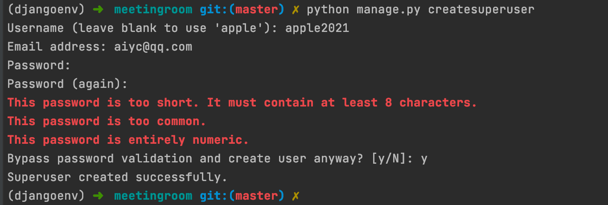

# 1. 使用 Django 创建第一个项目

框架的目标是要学会**要用**，这是最重要的！之后才是考虑进阶。


## 1.1 创建会议室管理项目，项目名为 meetingroom

```python
django-admin startproject meetingroom

cd meetingroom
```


## 1.2 启动项目

```python
python manage.py runserver 0.0.0.0:8080
```

> 0.0.0.0 这个表示监听本机所有的 IP 地址


## 1.3 访问项目

```python
http://127.0.0.1:8080
```


## 1.4 实际操作

```cmake
(djangoenv) ➜  使用Django创建第一个项目 git:(master) ✗ django-admin startproject meetingroom
(djangoenv) ➜  使用Django创建第一个项目 git:(master) ✗ cd meetingroom 
(djangoenv) ➜  meetingroom git:(master) ✗ ls
manage.py   meetingroom
(djangoenv) ➜  meetingroom git:(master) ✗ python manage.py runserver 0.0.0.0:8080
```


## 1.5 数据迁移

首先我们使用 makemigrations 创建数据库迁移，产生 SQL 脚本。然后我们使用 migrate 命令，把默认的 Model 同步到数据库。Django 会自动在数据库里面，为这些 Model 建立相应的表。

```python
python manage.py makemigrations 
python manage.py migrate 
```


## 1.6 创建管理员帐号

```python
python manage.py createsuperuser
```




## 1.7 代码文件

| 名称        | 作用                                                      |
| ----------- | --------------------------------------------------------- |
| asgi.py     | 异步网关接口                                              |
| wsgi.py     | 是 gateway interface 的简写，web server gateway interface |
| settings.py | Django 项目的配置文件                                     |


## 1.8 Settings.py 部分解析

| 名称               | 作用                                                         |
| ------------------ | ------------------------------------------------------------ |
| DEBUG = True       | 这个我们可以在开发环境下，看见出错的各种信息「包括异常信息」，所以，在生产环境要设置成 False，要不然别人访问的时候，都能看见各种调试信息。这很危险！ |
| ALLOWED_HOSTS = [] | 在这里配置那些 IP 可以访问这个应用，默认是 127.0.0.1 的端口可以访问。我可以在这里输入服务器外网的 IP ，这样我们的外网就可以访问。当然，我们通常不会在这个里面，把我们的外网 IP 配置进来。而是用一个网关服务。比如是用 Nginx 、Tengine 来做这个网关。把 Django 的应用开发出去。 |
| INSTALLED_APPS     | INSTALLED_APPS 的配置比较重要，它是 Django 里面安装的应用，这里面默认有安装 django.admin 等应用，我们自己的应用也要在这里面添加。 |
| MIDDLEWARE         | 中间件，包括安全的中间件、防跨站攻击的中间件、跟认证授权的中间件等等。 |
| TEMPLATES          | 模版引擎                                                     |
| DATABASES          | 数据库引擎                                                   |
| LANGUAGE_CODE      | 语言                                                         |

**代码链接：**[https://github.com/AndersonHJB/Django_Leraning/tree/main/1-使用Django创建第一个项目](https://github.com/AndersonHJB/Django_Leraning/tree/main/1-使用Django创建第一个项目)


