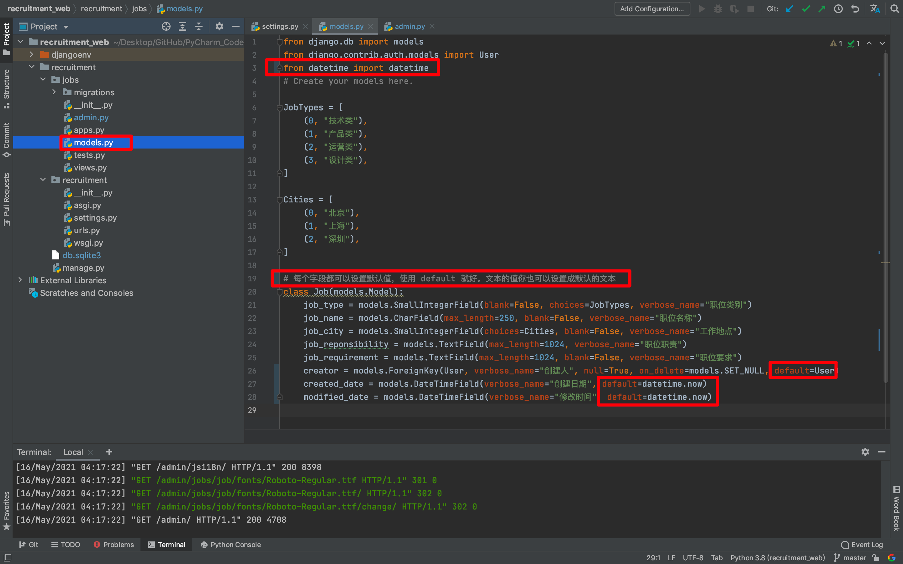
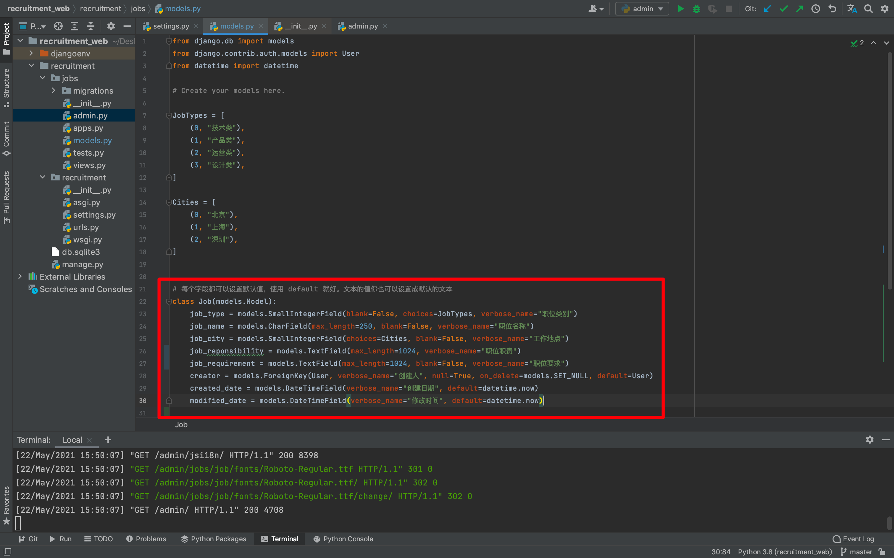
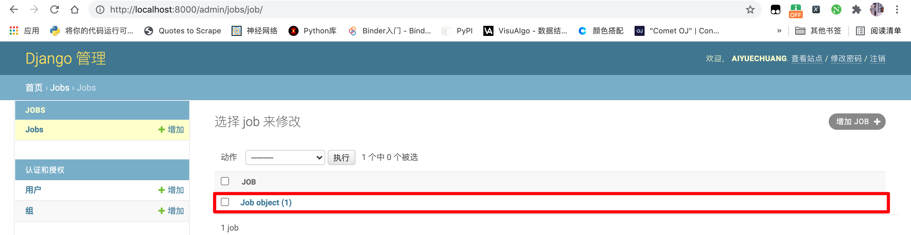
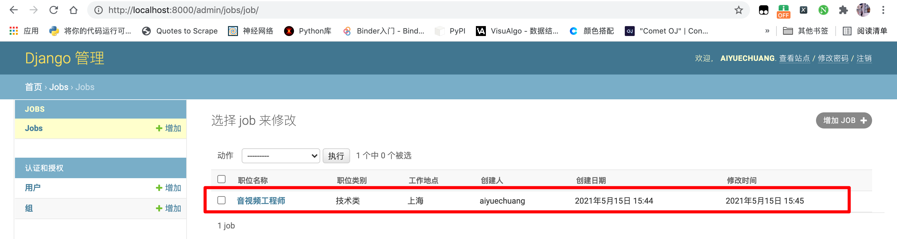
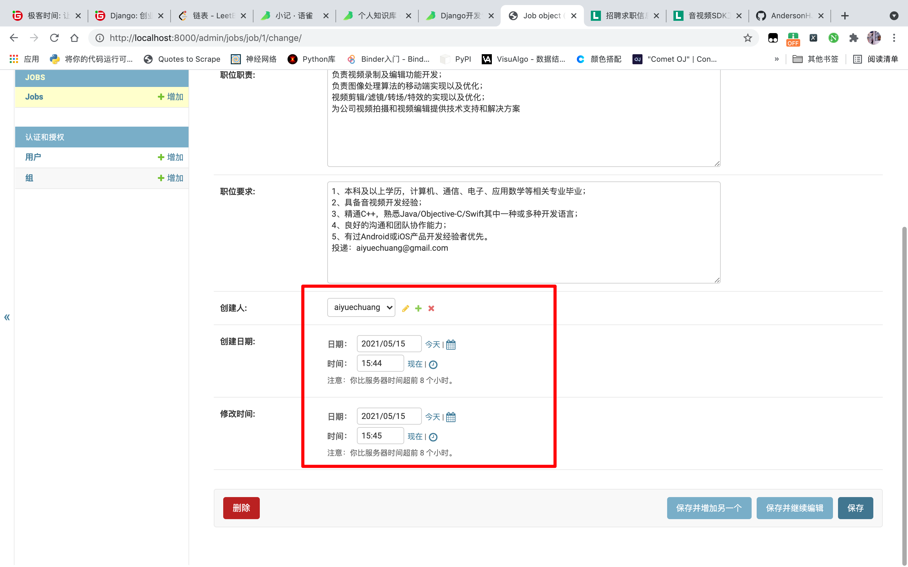
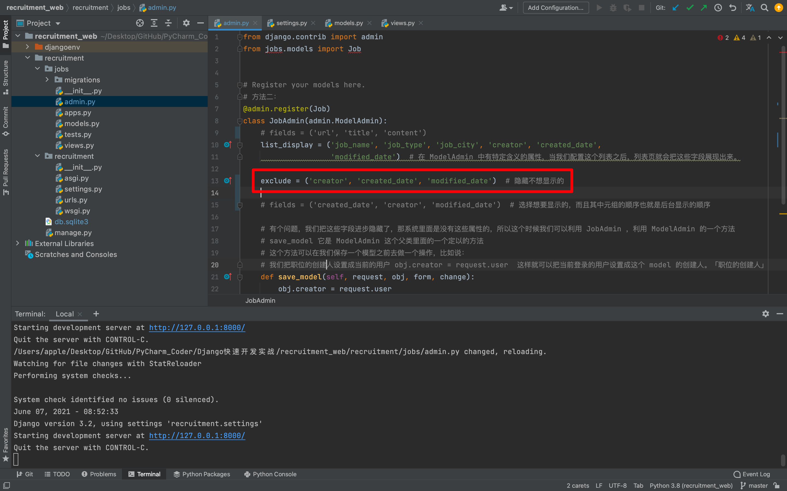
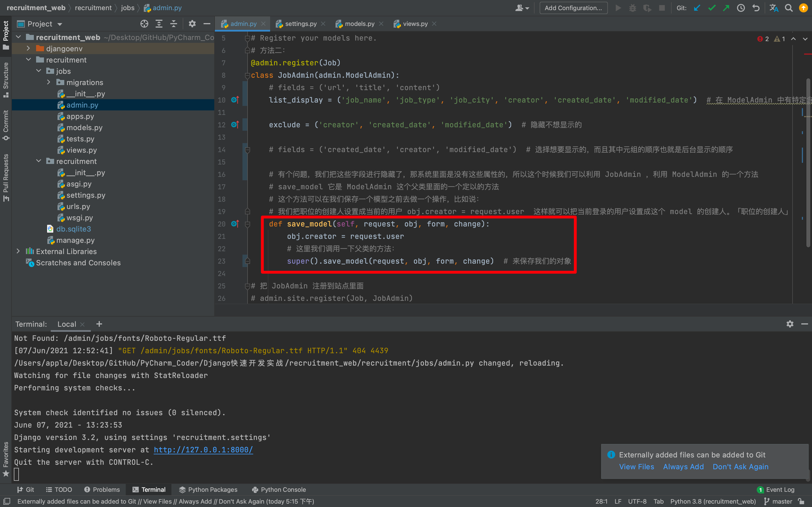
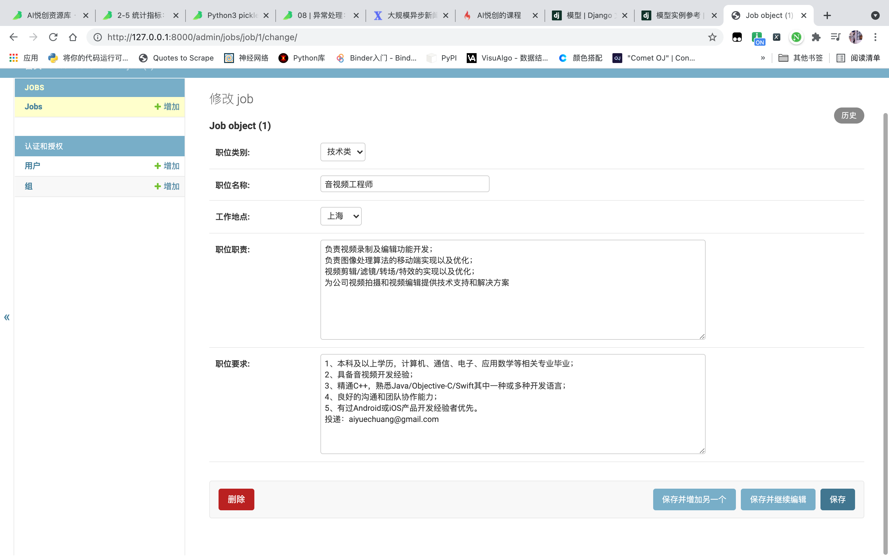

# 3. 产品体验优化：快速迭代完善应用

## 3.1 添加默认值

我们先把上门的尾巴先解决掉，添加默认值。「用户、日期」



记得保存所修改的代码，接下来我刷新然后进去看看，点击添加按钮，看作者和日期是否会有默认时间。


为了让你更好的理解，我将在加几个 default：

```python
from django.db import models
from django.contrib.auth.models import User
from datetime import datetime

# Create your models here.

JobTypes = [
    (0, "技术类"),
    (1, "产品类"),
    (2, "运营类"),
    (3, "设计类"),
]

Cities = [
    (0, "北京"),
    (1, "上海"),
    (2, "深圳"),
]


# 每个字段都可以设置默认值，使用 default 就好。文本的值你也可以设置成默认的文本
class Job(models.Model):
    job_type = models.SmallIntegerField(blank=False, choices=JobTypes, verbose_name="职位类别", default=JobTypes[0])
    job_name = models.CharField(max_length=250, blank=False, verbose_name="职位名称", default="填写职位名称")
    job_city = models.SmallIntegerField(choices=Cities, blank=False, verbose_name="工作地点", default=Cities[0])
    job_reponsibility = models.TextField(max_length=1024, verbose_name="职位职责", default="这里你可以填写你的职位职责")
    job_requirement = models.TextField(max_length=1024, blank=False, verbose_name="职位要求", default="这里可以写你招聘的职位要求")
    creator = models.ForeignKey(User, verbose_name="创建人", null=True, on_delete=models.SET_NULL, default=User)
    created_date = models.DateTimeField(verbose_name="创建日期", default=datetime.now)
    modified_date = models.DateTimeField(verbose_name="修改时间", default=datetime.now)
```

当然，我们不可能每一个都有默认，这肯定不合理，所以需要合理的安排。恢复成原来的代码：




## 3.2 修改管理界面的显示

默认生成了。接下来我们需要优化如下页面：



明显很不直观，我们希望可以达到如下效果：


我们直接修改该 app 下的 `admin.py` ：


```python
from django.contrib import admin
from jobs.models import Job


# Register your models here.

class JobAdmin(admin.ModelAdmin):
	list_display = ('job_name', 'job_type', 'job_city', 'creator', 'created_date',
	                'modified_date')  # 在 ModelAdmin 中有特定含义的属性，当我们配置这个列表之后，列表页就会把这些字段展现出来。


# 把 JobAdmin 注册到站点里面
admin.site.register(Job, JobAdmin)
# admin.site.register(Job)
```

效果：




## 3.3 隐藏内容

我们希望把下面的部分进行隐藏：



添加如下代码即可：

```python
exclude = ('creator', 'created_date', 'modified_date')  # 隐藏不想显示的
# fields = ('created_date', 'creator', 'modified_date')  # 选择想要显示的，而且其中元组的顺序也就是后台显示的顺序
```



接下来有个问题，我们把这些字段都隐藏了，那系统提交的时候是没有这些字段的。所以，我们可以使用如下方法：

```python
	def save_model(self, request, obj, form, change):
		obj.creator = request.user
		# 这里我们调用一下父类的方法：
		super().save_model(request, obj, form, change)  # 来保存我们的对象
```



接下来我们可以看看，我们的修改的时间和创建人都没有了：




## 3.4 再次添加一个新职位

接下来，我们可以再添加一个职位：

| 职位类别     | 技术类                                                       |
| ------------ | ------------------------------------------------------------ |
| **职位名称** | **Go高级后端开发工程师**                                     |
| **工作地点** | **上海**                                                     |
| **职位职责** | 1、参与与负责面向客户toB服务类（云平台）的产品研发及探索<br/>2、负责平台解决方案设计、性能优化<br/>3、积极跟进线上问题、持续推进平台可靠性、可用性优化 |
| **职位要求** | 1. 熟练使用Go、Python中至少一门语言，3年及以上项目开发经验，掌握Java、C、C++者优先<br/>2. 熟悉常用的开发框架，具备性能调优经验者优先<br/>3. 熟练掌握常见存储中间件(Mysql、Redis、MongoDB、Kafka或RocketMq)<br/>4. 熟悉HTTP、TCP/IP等协议<br/>5. 熟练掌握多线程编程，有大型分布式、高并发、高可用系统设计开发经验优先<br/>6. 良好的编码规范，工作积极主动，心态开放，有强烈的责任心和良好的团队合作精神 |


保存之后，我们就可以发现，可以正常显示了。


本节代码：[https://github.com/AndersonHJB/Django_Leraning/tree/main/03-产品体验优化：快速迭代完善应用](https://github.com/AndersonHJB/Django_Leraning/tree/main/03-产品体验优化：快速迭代完善应用)


