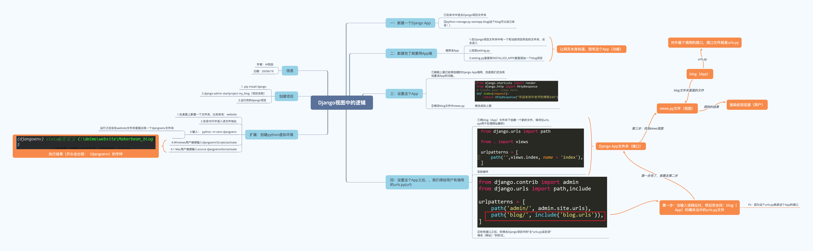

# 4. 添加自定义页面：让匿名用户可以浏览职位列表页




接下来，我们为我们的匿名用户（候选人）添加两个页面。使之可以浏览我们的职位列表，和看到每个职位详情。


- 列表页是独立页面，使用自定义的页面
- 添加如下页面
    - 职位列表页
    - 职位详情页
- 匿名用户可以访问


## 4.1 Django 的自定义模板

- Django 模板包含了输出的 HTML 页面的静态部分的内容
- 模板里面的动态内容在运行时被替换
- 在 views 里面指定每个 URL 使用哪个模板来渲染页面
- 模版继承与块(Template Inheritance & Block)
    - 模板继承允许定义一个骨架模板，骨架包含站点上的公共元素(如头部导航，尾部链接)
    - 骨架模板里面可以定义 Block 块，每一个 Block 块都可以在继承的页面上重新定义/覆盖
    - 一个页面可以继承自另一个页面

- 定义一个匿名访问页面的基础页面，基础页面中定义页头
- 添加页面 `job/templates/base.html`


## 4.2 Base 模板

创建网站时，几乎都有一些所有网页都将包含的元素。（title、SEO 等）在这种情况下，可编写一个包含通用 元素的父模板，并让每个网页都继承这个模板，而不必在每个网页中重复定义这些通用元素。这 种方法能让你专注于开发每个网页的独特方面，还能让修改项目的整体外观容易得多。

- 如下 `job/templates/base.html` 定义了站点的标题
- 使用 block 指令定义了页面内容块，块的名称为 content，这个块可以在继承的页面中重新定义

```html
<!--job/templates/base.html-->

<h1 style="margin:auto;width:50%;">AI悦创教育开放职位</h1>

<p></p>



```


## 4.3 添加职位列表页模板 – 继承自 base.html

父类「基类」创建好之后，我们来创建一个子模版。

- 这里使用 extends 指令来表示，这个模板继承自 `base.html` 模板
    - Block content 里面重新定义了 content 这个块
    - 变量：运行时会被替换， 变量用 `{{variable_name}}` 表示，变量是 views 层取到内容后 填充到模板中的参数
    - Tag：控制模板的逻辑，包括 if, for, block 都是 tab

```html



终于等到你，期待加入我们，用技术去探索一个新世界


    <ul>
    
        <li>{{job.type_name}} <a href="/job/{{ job.id }}/" style="color:blue">{{ job.job_name }}</a> {{job.city_name}}</li>
    
    </ul>

    <p>No jobs are available.</p>



```


如果我去直接访问 [http://127.0.0.1:8000/joblist](http://127.0.0.1:8000/joblist)：会出现如下结果。


显然，我们是访问不了。所以，我们需要定义路径。但定义路径之前我要把视图层把它加载进来。也就是把我们自定义的页面能够加进来。不过，在此之前，我还是要给你补充一个知识点。


## 4.4 补充：Django shell

输入一些数据后，就可通过交互式终端会话以编程方式查看这些数据了。这种交互式环境称 为 Django shell，是测试项目和排除其故障的理想之地。下面是一个交互式 shell 会话示例：

```python
(djangoenv) ➜  recruitment git:(master) ✗ python manage.py shell
Python 3.8.5 (default, Jul 21 2020, 10:42:08) 
[Clang 11.0.0 (clang-1100.0.33.17)] on darwin
Type "help", "copyright", "credits" or "license" for more information.
(InteractiveConsole)
>>> from jobs.models import Job
>>> Job.objects.all()
<QuerySet [<Job: 音视频工程师>, <Job: Go高级后端开发工程师>]>
>>> 
```

注意，这个地方如果想要返回 `<QuerySet [<Job: 音视频工程师>, <Job: Go高级后端开发工程师>]>` 则需要在 models 里面添加如下代码：

```python
    def __str__(self):
        return self.job_name
```


在活动的虚拟环境中执行时，命令 `python manage.py shell` 启动一个 Python 解释器，可使用它来探索存储在项目数据库中的数据。在这里，我们导入了模块 `jobs.models` 中的模型 Job，然后使用方法`Job.objects.all()` 来获取模型 Job 的所有实例；它返回的是一个列表，称为查询集(queryset)。

我们可以像遍历列表一样遍历查询集。下面演示了如何查看分配给每个主题对象的ID：

```python
>>> jobs = Job.objects.all()
>>> for job in jobs:
...     print(job.id, job)
... 
1 音视频工程师
2 Go高级后端开发工程师
>>> 
```

我们将返回的查询集存储在 jobs 中，然后打印每个主题的 id 属性和字符串表示。从输出可知，主题 **音视频工程师** 的 ID 为1，而 **Go高级后端开发工程师** 的 ID 为2。

知道对象的 ID 后，就可获取该对象并查看其任何属性。下面来看看主题 **音视频工程师** 的属性 **job_reponsibility** 和 **job_requirement** 的值：

```python
>>> j = Job.objects.get(id=1)
>>> j.
j.DoesNotExist(                   j.get_previous_by_modified_date(
j.MultipleObjectsReturned(        j.id
j.check(                          j.job_city
j.clean(                          j.job_name
j.clean_fields(                   j.job_reponsibility
j.created_date                    j.job_requirement
j.creator                         j.job_type
j.creator_id                      j.modified_date
j.date_error_message(             j.objects
j.delete(                         j.pk
j.from_db(                        j.prepare_database_save(
j.full_clean(                     j.refresh_from_db(
j.get_deferred_fields(            j.save(
j.get_job_city_display(           j.save_base(
j.get_job_type_display(           j.serializable_value(
j.get_next_by_created_date(       j.unique_error_message(
j.get_next_by_modified_date(      j.validate_unique(
j.get_previous_by_created_date(     
>>> j.job_reponsibility
'负责视频录制及编辑功能开发；\r\n负责图像处理算法的移动端实现以及优化；\r\n视频剪辑/滤镜决方案'
>>> j.job_requirement
'1、本科及以上学历，计算机、通信、电子、应用数学等相关专业毕业；\r\n2、具备音视频开发经一种或多种开发语言；\r\n4、良好的沟通和团队协作能力；\r\n5、有过Android或iOS产品开发经验者优先。\r\n投递：aiyuechuang@gmail.com'
>>> 
```

**QuerySet API 参考**：[https://docs.djangoproject.com/zh-hans/3.2/ref/models/querysets/](https://docs.djangoproject.com/zh-hans/3.2/ref/models/querysets/)

**注意：** 每次修改模型后，你都需要重启 shell，这样才能看到修改的效果。要退出 shell 会话，可按 `Ctr + D` ；如果你使用的是 Windows 系统，应按 `Ctr + Z` ，再按回车键。

**补充：**

```python
>>> from jobs.models import Job
>>> Job.objects.all()
<QuerySet [<Job: 音视频工程师>, <Job: Go高级后端开发工程师>]>
>>> Job.objects.all()[0]
<Job: 音视频工程师>
>>> Job.objects.all()[0].job_type
0
>>> Job.objects.all()[0].job_name
'音视频工程师'
```


## 4.5 views.py

**补充：** [https://docs.djangoproject.com/zh-hans/3.2/ref/models/querysets/#order-by](https://docs.djangoproject.com/zh-hans/3.2/ref/models/querysets/#order-by)

```python
>>> job_list = Job.objects.order_by('job_type')
>>> job_list[0]
<Job: 音视频工程师>
>>> job_list[0].job_city
1
```

Django 的视图有几种方法，我们可以用函数去定义，也可以用视图的类去定义。这里我们先用函数定义 views 层里面： 

```python
# Create your views here.
from django.shortcuts import render
from django.http import HttpResponse
from django.template import loader

from jobs.models import Job
from jobs.models import Cities, JobTypes # 因为这两个数据是 choice 来选择的，数据提取的时候只提取出了数字。

def joblist(request):
	# https://docs.djangoproject.com/zh-hans/3.2/ref/models/querysets/#order-by
    job_list = Job.objects.order_by('job_type')  # 从数据库获取，并且以 job_type 排序
    template = loader.get_template('joblist.html')  # 加载模版
    """定义上下文——map"""
    context = {'job_list': job_list}
    for job in job_list:
        """因为，我们需要显示的数据是：工作地点、工作类型，但是我们的这两个数据都是由 choices 来实现选择的。所以，job.xxx 都是返回下标的「也就是数字」"""
        job.city_name = Cities[job.job_city]
        job.job_type = JobTypes[job.job_type]
    return HttpResponse(template.render(context))
```


## 4.6 添加 APP 的 urls.py

到目前为止，我们的 app 进行了编写，接下来给我的 app 来写个路由。需要新建一个 `urls.py` 。

```python
from django.conf.urls import url
from jobs import views

urlpatterns = [
	# 职位列表
	url(r"^joblist/", views.joblist, name="joblist")
]
```

```python
# 比较好理解的方法
from django.urls import path
from . import views

urlpatterns = [
	path('joblist/', views.joblist, name='joblist'),
]
```

接下来，我们来访问：[http://127.0.0.1:8000/joblist](http://127.0.0.1:8000/joblist) 发现还是不能访问，这是为什么呢？我们还没编写项目的 `urls.py`


## 4.7 编写项目 urls.py

```python
from django.contrib import admin
from django.urls import path
from django.conf.urls import include, url

urlpatterns = [
    path('admin/', admin.site.urls),
	path(r"", include("jobs.urls"))
]
```

```python
# 比较好理解的方法
from django.contrib import admin
from django.urls import path, include
# from django.urls import include

urlpatterns = [
    path('admin/', admin.site.urls),
	path("", include("jobs.urls"))
]
```

我们接下来，可以访问这个页面来查看一下。


我们可以发现：

1. 上图的红色框中，数据显示不正常；
2. 缺少职位类别，表面我们上面写错了；

我们去修改一下吧。

```python
<!--joblist.html-->

<meta charset="UTF-8">

终于等到你，期待加入我们，用技术去探索一个新世界


    <ul>
    
        <li>{{job.job_type}} <a href="/job/{{ job.id }}/" style="color:blue">{{ job.job_name }}</a> {{job.city_name}}</li>
    
    </ul>

    <p>No jobs are available.</p>



```

```python
# views.py
# Create your views here.
from django.shortcuts import render
from django.http import HttpResponse
from django.template import loader

from jobs.models import Job
from jobs.models import Cities, JobTypes  # 因为这两个数据是 choice 来选择的，数据提取的时候只提取出了数字。


def joblist(request):
	# https://docs.djangoproject.com/zh-hans/3.2/ref/models/querysets/#order-by
	job_list = Job.objects.order_by('job_type')  # 从数据库获取，并且以 job_type 排序
	template = loader.get_template('joblist.html')  # 加载模版
	"""定义上下文——map"""
	context = {'job_list': job_list}
	for job in job_list:
		"""因为，我们需要显示的数据是：工作地点、工作类型，但是我们的这两个数据都是由 choices 来实现选择的。所以，job.xxx 都是返回下标的「也就是数字」"""
		job.city_name = Cities[job.job_city][1]  # 工作地点
		job.job_type = JobTypes[job.job_type][1]  # 职位类别
	return HttpResponse(template.render(context))
```

本节代码：[https://github.com/AndersonHJB/Django_Leraning/tree/main/04-添加自定义页面：让匿名用户可以浏览职位列表页](https://github.com/AndersonHJB/Django_Leraning/tree/main/04-%E6%B7%BB%E5%8A%A0%E8%87%AA%E5%AE%9A%E4%B9%89%E9%A1%B5%E9%9D%A2%EF%BC%9A%E8%AE%A9%E5%8C%BF%E5%90%8D%E7%94%A8%E6%88%B7%E5%8F%AF%E4%BB%A5%E6%B5%8F%E8%A7%88%E8%81%8C%E4%BD%8D%E5%88%97%E8%A1%A8%E9%A1%B5)


