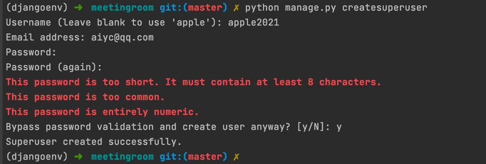
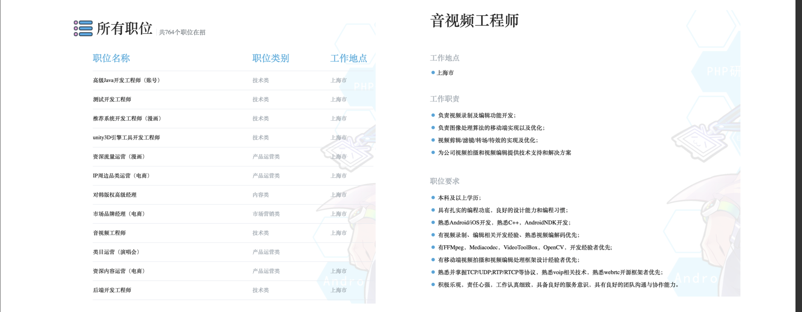
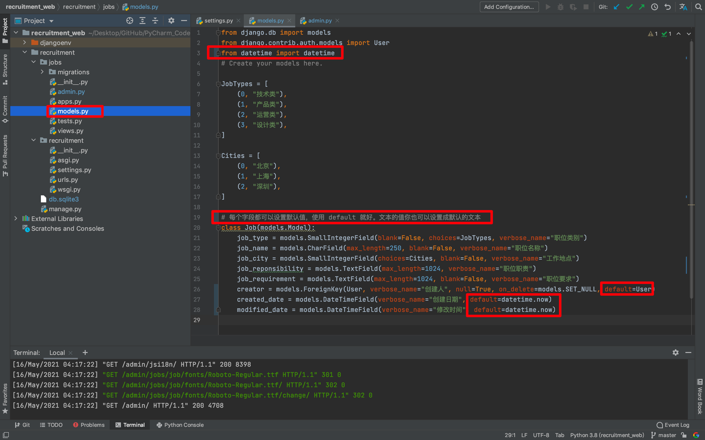

# 1. 使用 Django 创建第一个项目

框架的目标是要学会**要用**，这是最重要的！之后才是考虑进阶。


## 1.1 创建会议室管理项目，项目名为 meetingroom

```python
django-admin startproject meetingroom

cd meetingroom
```


## 1.2 启动项目

```python
python manage.py runserver 0.0.0.0:8080
```

> 0.0.0.0 这个表示监听本机所有的 IP 地址


## 1.3 访问项目

```python
http://127.0.0.1:8080
```


## 1.4 实际操作

```cmake
(djangoenv) ➜  使用Django创建第一个项目 git:(master) ✗ django-admin startproject meetingroom
(djangoenv) ➜  使用Django创建第一个项目 git:(master) ✗ cd meetingroom 
(djangoenv) ➜  meetingroom git:(master) ✗ ls
manage.py   meetingroom
(djangoenv) ➜  meetingroom git:(master) ✗ python manage.py runserver 0.0.0.0:8080
```


## 1.5 数据迁移

首先我们使用 makemigrations 创建数据库迁移，产生 SQL 脚本。然后我们使用 migrate 命令，把默认的 Model 同步到数据库。Django 会自动在数据库里面，为这些 Model 建立相应的表。

```python
python manage.py makemigrations 
python manage.py migrate 
```


## 1.6 创建管理员帐号

```python
python manage.py createsuperuser
```




## 1.7 代码文件

| 名称        | 作用                                                      |
| ----------- | --------------------------------------------------------- |
| asgi.py     | 异步网关接口                                              |
| wsgi.py     | 是 gateway interface 的简写，web server gateway interface |
| settings.py | Django 项目的配置文件                                     |


## 1.8 Settings.py 部分解析

| 名称               | 作用                                                         |
| ------------------ | ------------------------------------------------------------ |
| DEBUG = True       | 这个我们可以在开发环境下，看见出错的各种信息「包括异常信息」，所以，在生产环境要设置成 False，要不然别人访问的时候，都能看见各种调试信息。这很危险！ |
| ALLOWED_HOSTS = [] | 在这里配置那些 IP 可以访问这个应用，默认是 127.0.0.1 的端口可以访问。我可以在这里输入服务器外网的 IP ，这样我们的外网就可以访问。当然，我们通常不会在这个里面，把我们的外网 IP 配置进来。而是用一个网关服务。比如是用 Nginx 、Tengine 来做这个网关。把 Django 的应用开发出去。 |
| INSTALLED_APPS     | INSTALLED_APPS 的配置比较重要，它是 Django 里面安装的应用，这里面默认有安装 django.admin 等应用，我们自己的应用也要在这里面添加。 |
| MIDDLEWARE         | 中间件，包括安全的中间件、防跨站攻击的中间件、跟认证授权的中间件等等。 |
| TEMPLATES          | 模版引擎                                                     |
| DATABASES          | 数据库引擎                                                   |
| LANGUAGE_CODE      | 语言                                                         |

**代码链接：**[https://github.com/AndersonHJB/Django_Leraning/tree/main/1-使用Django创建第一个项目](https://github.com/AndersonHJB/Django_Leraning/tree/main/1-使用Django创建第一个项目)


# 2. 10分钟如何创建一个可以管理职位的后台

创建项目：

```python
# 1. 创建项目
django-admin startproject recruitment
# 2. 创建管理员
python manage.py createsuperuser
```

**本项目帐号密码：**

```python
帐号：aiyuechuang
密码：123123
```


## 2.1 目标：招聘系统的职位管理

- 产品需求
    - 发布职位
    - 匿名用户（候选人）能够浏览职位
    - 匿名用户可以投递职位


## 2.2 职位管理系统——建模

- 职位名称，类别，工作地点，职位职责，职位要求，发布人，发布日期，修改日期



- 管理员是 Django admin 里面的内置角色，创建管理员之后，管理员就可以使用系统功能，这方面不需要我们额外的开发
- 职位是我们系统中的主要模型

接下来，我们来创建 APP：

```python
python manage.py startapp jobs
```

接下来，我们在项目的 `settings.py` 里面添加，这个 app：


接下来，在 app jobs 中的 `models.py` 里面，定义我们的职位模型。官方的文档：[https://docs.djangoproject.com/zh-hans/3.2/ref/models/fields/](https://docs.djangoproject.com/zh-hans/3.2/ref/models/fields/)

```python
from django.db import models
from django.contrib.auth.models import User

# Create your models here.

JobTypes = [
	(0, "技术类"),
	(1, "产品类"),
	(2, "运营类"),
	(3, "设计类"),
]

Cities = [
	(0, "北京"),
	(1, "上海"),
	(2, "深圳"),
]


class Job(models.Model):
	job_type = models.SmallIntegerField(blank=False, choices=JobTypes, verbose_name="职位类别")
	job_name = models.CharField(max_length=250, blank=False, verbose_name="职位名称")
	job_city = models.SmallIntegerField(choices=Cities, blank=False, verbose_name="工作地点")
	job_reponsibility = models.TextField(max_length=1024, verbose_name="职位职责")
	job_requirement = models.TextField(max_length=1024, blank=False, verbose_name="职位要求")
	creator = models.ForeignKey(User, verbose_name="创建人", null=True, on_delete=models.SET_NULL)
	created_date = models.DateTimeField(verbose_name="创建日期")
	modified_date = models.DateTimeField(verbose_name="修改时间")
```

接下来，运行应用看看情况。

```python
(djangoenv) ➜  recruitment git:(master) ✗ ls
db.sqlite3  jobs        manage.py   recruitment
(djangoenv) ➜  recruitment git:(master) ✗ python manage.py runserver
Watching for file changes with StatReloader
Performing system checks...

System check identified no issues (0 silenced).
May 15, 2021 - 06:20:38
Django version 3.2, using settings 'recruitment.settings'
Starting development server at http://127.0.0.1:8000/
Quit the server with CONTROL-C.
```

然后，我们访问后台链接：[http://127.0.0.1:8000/admin/](http://127.0.0.1:8000/admin/) 


我们发现并没有我们的 Job，那是我们还没有在 jobs 里面的 `admin.py` 后台注册。


**补充：** [Django 管理站点](https://docs.djangoproject.com/zh-hans/3.2/ref/contrib/admin/)：https://docs.djangoproject.com/zh-hans/3.2/ref/contrib/admin/

这回我们看后台：


点进去看看：


**这是什么问题呢？** —— 就是数据库表还没有同步！

```python
(djangoenv) ➜  recruitment git:(master) ✗ python manage.py makemigrations 
```

```python
(djangoenv) ➜  recruitment git:(master) ✗ python manage.py migrate 
```

当然，我们还可以查看修改数据的信息：


访问后台：


我们可以添加一个职位试一试：


## demo 文本：

| 名称          | 文本                                                         |
| ------------- | ------------------------------------------------------------ |
| **类别:**     | 技术类                                                       |
| **职位名称:** | 音视频工程师                                                 |
| **工作地点:** | 上海                                                         |
| **职位职责:** | 负责视频录制及编辑功能开发；<br/>负责图像处理算法的移动端实现以及优化；<br/>视频剪辑/滤镜/转场/特效的实现以及优化；<br/>为公司视频拍摄和视频编辑提供技术支持和解决方案 |
| **职位要求:** | 1、本科及以上学历，计算机、通信、电子、应用数学等相关专业毕业；<br/>2、具备音视频开发经验；<br/>3、精通C++，熟悉Java/Objective-C/Swift其中一种或多种开发语言；<br/>4、良好的沟通和团队协作能力；<br/>5、有过Android或iOS产品开发经验者优先。<br/>投递：aiyuechuang@gmail.com |


上图红色方框，其实不算友好，我们希望默认就是创建者用户和当前日期时间。


还有就是不太好的地方就是上图红色框中的名称，还是默认的并不是我们的职位名称。

**代码链接：**[https://github.com/AndersonHJB/Django_Leraning/tree/main/2-10分钟如何创建一个可以管理职位的后台](https://github.com/AndersonHJB/Django_Leraning/tree/main/2-10分钟如何创建一个可以管理职位的后台)


# 3. 产品体验优化：快速迭代完善应用

## 3.1 添加默认值

我们先把上门的尾巴先解决掉，添加默认值。「用户、日期」



记得保存所修改的代码，接下来我刷新然后进去看看，点击添加按钮，看作者和日期是否会有默认时间。


为了让你更好的理解，我将在加几个 default：

```python
from django.db import models
from django.contrib.auth.models import User
from datetime import datetime

# Create your models here.

JobTypes = [
    (0, "技术类"),
    (1, "产品类"),
    (2, "运营类"),
    (3, "设计类"),
]

Cities = [
    (0, "北京"),
    (1, "上海"),
    (2, "深圳"),
]


# 每个字段都可以设置默认值，使用 default 就好。文本的值你也可以设置成默认的文本
class Job(models.Model):
    job_type = models.SmallIntegerField(blank=False, choices=JobTypes, verbose_name="职位类别", default=JobTypes[0])
    job_name = models.CharField(max_length=250, blank=False, verbose_name="职位名称", default="填写职位名称")
    job_city = models.SmallIntegerField(choices=Cities, blank=False, verbose_name="工作地点", default=Cities[0])
    job_reponsibility = models.TextField(max_length=1024, verbose_name="职位职责", default="这里你可以填写你的职位职责")
    job_requirement = models.TextField(max_length=1024, blank=False, verbose_name="职位要求", default="这里可以写你招聘的职位要求")
    creator = models.ForeignKey(User, verbose_name="创建人", null=True, on_delete=models.SET_NULL, default=User)
    created_date = models.DateTimeField(verbose_name="创建日期", default=datetime.now)
    modified_date = models.DateTimeField(verbose_name="修改时间", default=datetime.now)
```

当然，我们不可能每一个都有默认，这肯定不合理，所以需要合理的安排。恢复成原来的代码：


## 3.2 修改管理界面的显示

默认生成了。接下来我们需要优化如下页面：


明显很不直观，我们希望可以达到如下效果：


我们直接修改该 app 下的 `admin.py` ：


```python
from django.contrib import admin
from jobs.models import Job


# Register your models here.

class JobAdmin(admin.ModelAdmin):
	list_display = ('job_name', 'job_type', 'job_city', 'creator', 'created_date',
	                'modified_date')  # 在 ModelAdmin 中有特定含义的属性，当我们配置这个列表之后，列表页就会把这些字段展现出来。


# 把 JobAdmin 注册到站点里面
admin.site.register(Job, JobAdmin)
# admin.site.register(Job)
```

效果：


## 3.3 隐藏内容

我们希望把下面的部分进行隐藏：


添加如下代码即可：

```python
exclude = ('creator', 'created_date', 'modified_date')  # 隐藏不想显示的
# fields = ('created_date', 'creator', 'modified_date')  # 选择想要显示的，而且其中元组的顺序也就是后台显示的顺序
```


接下来有个问题，我们把这些字段都隐藏了，那系统提交的时候是没有这些字段的。所以，我们可以使用如下方法：

```python
	def save_model(self, request, obj, form, change):
		obj.creator = request.user
		# 这里我们调用一下父类的方法：
		super().save_model(request, obj, form, change)  # 来保存我们的对象
```


接下来我们可以看看，我们的修改的时间和创建人都没有了：


## 3.4 再次添加一个新职位

接下来，我们可以再添加一个职位：

| 职位类别     | 技术类                                                       |
| ------------ | ------------------------------------------------------------ |
| **职位名称** | **Go高级后端开发工程师**                                     |
| **工作地点** | **上海**                                                     |
| **职位职责** | 1、参与与负责面向客户toB服务类（云平台）的产品研发及探索<br/>2、负责平台解决方案设计、性能优化<br/>3、积极跟进线上问题、持续推进平台可靠性、可用性优化 |
| **职位要求** | 1. 熟练使用Go、Python中至少一门语言，3年及以上项目开发经验，掌握Java、C、C++者优先<br/>2. 熟悉常用的开发框架，具备性能调优经验者优先<br/>3. 熟练掌握常见存储中间件(Mysql、Redis、MongoDB、Kafka或RocketMq)<br/>4. 熟悉HTTP、TCP/IP等协议<br/>5. 熟练掌握多线程编程，有大型分布式、高并发、高可用系统设计开发经验优先<br/>6. 良好的编码规范，工作积极主动，心态开放，有强烈的责任心和良好的团队合作精神 |


保存之后，我们就可以发现，可以正常显示了。


本节代码：[https://github.com/AndersonHJB/Django_Leraning/tree/main/03-产品体验优化：快速迭代完善应用](https://github.com/AndersonHJB/Django_Leraning/tree/main/03-产品体验优化：快速迭代完善应用)


# 4. 添加自定义页面：让匿名用户可以浏览职位列表页


接下来，我们为我们的匿名用户（候选人）添加两个页面。使之可以浏览我们的职位列表，和看到每个职位详情。


- 列表页是独立页面，使用自定义的页面
- 添加如下页面
    - 职位列表页
    - 职位详情页
- 匿名用户可以访问


## 4.1 Django 的自定义模板

- Django 模板包含了输出的 HTML 页面的静态部分的内容
- 模板里面的动态内容在运行时被替换
- 在 views 里面指定每个 URL 使用哪个模板来渲染页面
- 模版继承与块(Template Inheritance & Block)
    - 模板继承允许定义一个骨架模板，骨架包含站点上的公共元素(如头部导航，尾部链接)
    - 骨架模板里面可以定义 Block 块，每一个 Block 块都可以在继承的页面上重新定义/覆盖
    - 一个页面可以继承自另一个页面

- 定义一个匿名访问页面的基础页面，基础页面中定义页头
- 添加页面 `job/templates/base.html`


## 4.2 Base 模板

创建网站时，几乎都有一些所有网页都将包含的元素。（title、SEO 等）在这种情况下，可编写一个包含通用 元素的父模板，并让每个网页都继承这个模板，而不必在每个网页中重复定义这些通用元素。这 种方法能让你专注于开发每个网页的独特方面，还能让修改项目的整体外观容易得多。

- 如下 `job/templates/base.html` 定义了站点的标题
- 使用 block 指令定义了页面内容块，块的名称为 content，这个块可以在继承的页面中重新定义

```html
<!--job/templates/base.html-->

<h1 style="margin:auto;width:50%;">AI悦创教育开放职位</h1>

<p></p>



```


## 4.3 添加职位列表页模板 – 继承自 base.html

父类「基类」创建好之后，我们来创建一个子模版。

- 这里使用 extends 指令来表示，这个模板继承自 `base.html` 模板
    - Block content 里面重新定义了 content 这个块
    - 变量：运行时会被替换， 变量用 `{{variable_name}}` 表示，变量是 views 层取到内容后 填充到模板中的参数
    - Tag：控制模板的逻辑，包括 if, for, block 都是 tab

```html



终于等到你，期待加入我们，用技术去探索一个新世界


    <ul>
    
        <li>{{job.type_name}} <a href="/job/{{ job.id }}/" style="color:blue">{{ job.job_name }}</a> {{job.city_name}}</li>
    
    </ul>

    <p>No jobs are available.</p>



```


如果我去直接访问 [http://127.0.0.1:8000/joblist](http://127.0.0.1:8000/joblist)：会出现如下结果。


显然，我们是访问不了。所以，我们需要定义路径。但定义路径之前我要把视图层把它加载进来。也就是把我们自定义的页面能够加进来。不过，在此之前，我还是要给你补充一个知识点。


## 4.4 补充：Django shell

输入一些数据后，就可通过交互式终端会话以编程方式查看这些数据了。这种交互式环境称 为 Django shell，是测试项目和排除其故障的理想之地。下面是一个交互式 shell 会话示例：

```python
(djangoenv) ➜  recruitment git:(master) ✗ python manage.py shell
Python 3.8.5 (default, Jul 21 2020, 10:42:08) 
[Clang 11.0.0 (clang-1100.0.33.17)] on darwin
Type "help", "copyright", "credits" or "license" for more information.
(InteractiveConsole)
>>> from jobs.models import Job
>>> Job.objects.all()
<QuerySet [<Job: 音视频工程师>, <Job: Go高级后端开发工程师>]>
>>> 
```

注意，这个地方如果想要返回 `<QuerySet [<Job: 音视频工程师>, <Job: Go高级后端开发工程师>]>` 则需要在 models 里面添加如下代码：

```python
    def __str__(self):
        return self.job_name
```


在活动的虚拟环境中执行时，命令 `python manage.py shell` 启动一个 Python 解释器，可使用它来探索存储在项目数据库中的数据。在这里，我们导入了模块 `jobs.models` 中的模型 Job，然后使用方法`Job.objects.all()` 来获取模型 Job 的所有实例；它返回的是一个列表，称为查询集(queryset)。

我们可以像遍历列表一样遍历查询集。下面演示了如何查看分配给每个主题对象的ID：

```python
>>> jobs = Job.objects.all()
>>> for job in jobs:
...     print(job.id, job)
... 
1 音视频工程师
2 Go高级后端开发工程师
>>> 
```

我们将返回的查询集存储在 jobs 中，然后打印每个主题的 id 属性和字符串表示。从输出可知，主题 **音视频工程师** 的 ID 为1，而 **Go高级后端开发工程师** 的 ID 为2。

知道对象的 ID 后，就可获取该对象并查看其任何属性。下面来看看主题 **音视频工程师** 的属性 **job_reponsibility** 和 **job_requirement** 的值：

```python
>>> j = Job.objects.get(id=1)
>>> j.
j.DoesNotExist(                   j.get_previous_by_modified_date(
j.MultipleObjectsReturned(        j.id
j.check(                          j.job_city
j.clean(                          j.job_name
j.clean_fields(                   j.job_reponsibility
j.created_date                    j.job_requirement
j.creator                         j.job_type
j.creator_id                      j.modified_date
j.date_error_message(             j.objects
j.delete(                         j.pk
j.from_db(                        j.prepare_database_save(
j.full_clean(                     j.refresh_from_db(
j.get_deferred_fields(            j.save(
j.get_job_city_display(           j.save_base(
j.get_job_type_display(           j.serializable_value(
j.get_next_by_created_date(       j.unique_error_message(
j.get_next_by_modified_date(      j.validate_unique(
j.get_previous_by_created_date(     
>>> j.job_reponsibility
'负责视频录制及编辑功能开发；\r\n负责图像处理算法的移动端实现以及优化；\r\n视频剪辑/滤镜决方案'
>>> j.job_requirement
'1、本科及以上学历，计算机、通信、电子、应用数学等相关专业毕业；\r\n2、具备音视频开发经一种或多种开发语言；\r\n4、良好的沟通和团队协作能力；\r\n5、有过Android或iOS产品开发经验者优先。\r\n投递：aiyuechuang@gmail.com'
>>> 
```

**QuerySet API 参考**：[https://docs.djangoproject.com/zh-hans/3.2/ref/models/querysets/](https://docs.djangoproject.com/zh-hans/3.2/ref/models/querysets/)

**注意：** 每次修改模型后，你都需要重启 shell，这样才能看到修改的效果。要退出 shell 会话，可按 `Ctr + D` ；如果你使用的是 Windows 系统，应按 `Ctr + Z` ，再按回车键。

**补充：**

```python
>>> from jobs.models import Job
>>> Job.objects.all()
<QuerySet [<Job: 音视频工程师>, <Job: Go高级后端开发工程师>]>
>>> Job.objects.all()[0]
<Job: 音视频工程师>
>>> Job.objects.all()[0].job_type
0
>>> Job.objects.all()[0].job_name
'音视频工程师'
```


## 4.5 views.py

**补充：** [https://docs.djangoproject.com/zh-hans/3.2/ref/models/querysets/#order-by](https://docs.djangoproject.com/zh-hans/3.2/ref/models/querysets/#order-by)

```python
>>> job_list = Job.objects.order_by('job_type')
>>> job_list[0]
<Job: 音视频工程师>
>>> job_list[0].job_city
1
```

Django 的视图有几种方法，我们可以用函数去定义，也可以用视图的类去定义。这里我们先用函数定义 views 层里面： 

```python
# Create your views here.
from django.shortcuts import render
from django.http import HttpResponse
from django.template import loader

from jobs.models import Job
from jobs.models import Cities, JobTypes # 因为这两个数据是 choice 来选择的，数据提取的时候只提取出了数字。

def joblist(request):
	# https://docs.djangoproject.com/zh-hans/3.2/ref/models/querysets/#order-by
    job_list = Job.objects.order_by('job_type')  # 从数据库获取，并且以 job_type 排序
    template = loader.get_template('joblist.html')  # 加载模版
    """定义上下文——map"""
    context = {'job_list': job_list}
    for job in job_list:
        """因为，我们需要显示的数据是：工作地点、工作类型，但是我们的这两个数据都是由 choices 来实现选择的。所以，job.xxx 都是返回下标的「也就是数字」"""
        job.city_name = Cities[job.job_city]
        job.job_type = JobTypes[job.job_type]
    return HttpResponse(template.render(context))
```


## 4.6 添加 APP 的 urls.py

到目前为止，我们的 app 进行了编写，接下来给我的 app 来写个路由。需要新建一个 `urls.py` 。

```python
from django.conf.urls import url
from jobs import views

urlpatterns = [
	# 职位列表
	url(r"^joblist/", views.joblist, name="joblist")
]
```

```python
# 比较好理解的方法
from django.urls import path
from . import views

urlpatterns = [
	path('joblist/', views.joblist, name='joblist'),
]
```

接下来，我们来访问：[http://127.0.0.1:8000/joblist](http://127.0.0.1:8000/joblist) 发现还是不能访问，这是为什么呢？我们还没编写项目的 `urls.py`


## 4.7 编写项目 urls.py

```python
from django.contrib import admin
from django.urls import path
from django.conf.urls import include, url

urlpatterns = [
    path('admin/', admin.site.urls),
	path(r"", include("jobs.urls"))
]
```

```python
# 比较好理解的方法
from django.contrib import admin
from django.urls import path, include
# from django.urls import include

urlpatterns = [
    path('admin/', admin.site.urls),
	path("", include("jobs.urls"))
]
```

我们接下来，可以访问这个页面来查看一下。


我们可以发现：

1. 上图的红色框中，数据显示不正常；
2. 缺少职位类别，表面我们上面写错了；

我们去修改一下吧。

```python
<!--joblist.html-->

<meta charset="UTF-8">

终于等到你，期待加入我们，用技术去探索一个新世界


    <ul>
    
        <li>{{job.job_type}} <a href="/job/{{ job.id }}/" style="color:blue">{{ job.job_name }}</a> {{job.city_name}}</li>
    
    </ul>

    <p>No jobs are available.</p>



```

```python
# views.py
# Create your views here.
from django.shortcuts import render
from django.http import HttpResponse
from django.template import loader

from jobs.models import Job
from jobs.models import Cities, JobTypes  # 因为这两个数据是 choice 来选择的，数据提取的时候只提取出了数字。


def joblist(request):
	# https://docs.djangoproject.com/zh-hans/3.2/ref/models/querysets/#order-by
	job_list = Job.objects.order_by('job_type')  # 从数据库获取，并且以 job_type 排序
	template = loader.get_template('joblist.html')  # 加载模版
	"""定义上下文——map"""
	context = {'job_list': job_list}
	for job in job_list:
		"""因为，我们需要显示的数据是：工作地点、工作类型，但是我们的这两个数据都是由 choices 来实现选择的。所以，job.xxx 都是返回下标的「也就是数字」"""
		job.city_name = Cities[job.job_city][1]  # 工作地点
		job.job_type = JobTypes[job.job_type][1]  # 职位类别
	return HttpResponse(template.render(context))
```

本节代码：


