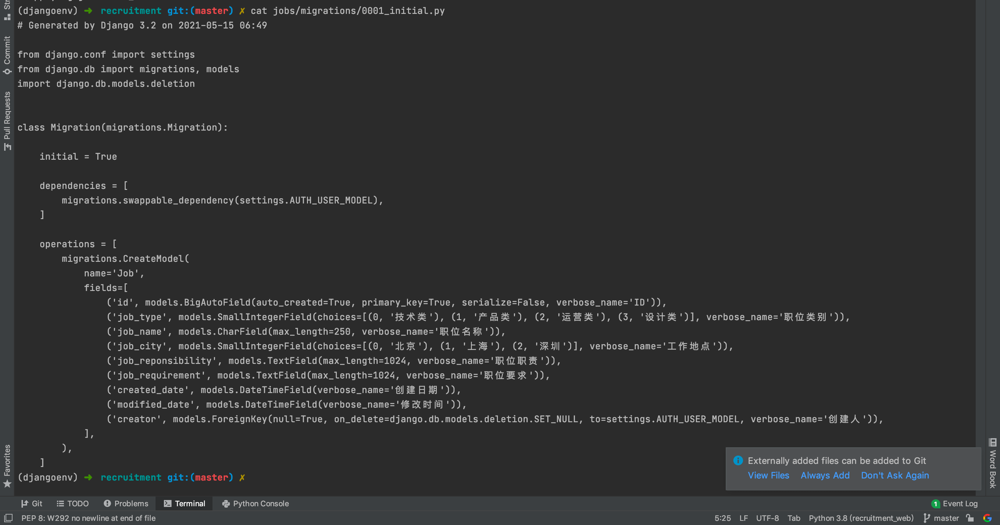
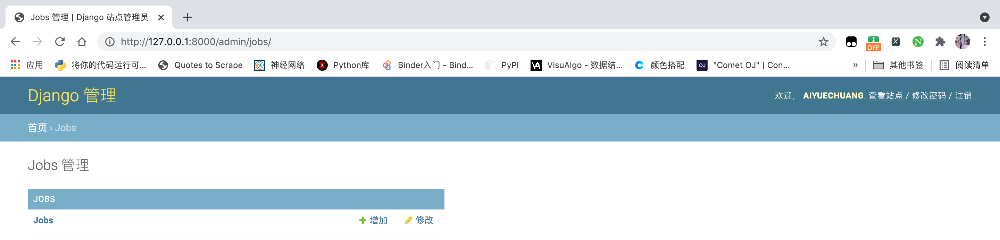
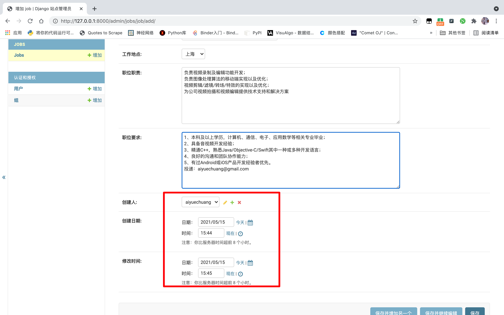

# 1. 使用 Django 创建第一个项目

## 1.1 创建会议室管理项目，项目名为 meetingroom

```python
django-admin startproject meetingroom

cd meetingroom
```


## 1.2 启动项目

```python
python manage.py runserver 0.0.0.0:8080
```

> 0.0.0.0 这个表示监听本机所有的 IP 地址


## 1.3 访问项目

```python
http://127.0.0.1:8080
```


## 1.4 实际操作

```cmake
(djangoenv) ➜  使用Django创建第一个项目 git:(master) ✗ django-admin startproject meetingroom
(djangoenv) ➜  使用Django创建第一个项目 git:(master) ✗ cd meetingroom 
(djangoenv) ➜  meetingroom git:(master) ✗ ls
manage.py   meetingroom
(djangoenv) ➜  meetingroom git:(master) ✗ python manage.py runserver 0.0.0.0:8080
```


## 1.5 数据迁移

首先我们使用 makemigrations 创建数据库迁移，产生 SQL 脚本。然后我们使用 migrate 命令，把默认的 Model 同步到数据库。Django 会自动在数据库里面，为这些 Model 建立相应的表。

```python
python manage.py makemigrations 
python manage.py migrate 
```


## 1.6 创建管理员帐号

```python
python manage.py createsuperuser
```


## 1.7 代码文件

| 名称        | 作用                                                      |
| ----------- | --------------------------------------------------------- |
| asgi.py     | 异步网关接口                                              |
| wsgi.py     | 是 gateway interface 的简写，web server gateway interface |
| settings.py | Django 项目的配置文件                                     |


## 1.8 Settings.py 部分解析

| 名称               | 作用                                                         |
| ------------------ | ------------------------------------------------------------ |
| DEBUG = True       | 这个我们可以在开发环境下，看见出错的各种信息「包括异常信息」，所以，在生产环境要设置成 False，要不然别人访问的时候，都能看见各种调试信息。这很危险！ |
| ALLOWED_HOSTS = [] | 在这里配置那些 IP 可以访问这个应用，默认是 127.0.0.1 的端口可以访问。我可以在这里输入服务器外网的 IP ，这样我们的外网就可以访问。当然，我们通常不会在这个里面，把我们的外网 IP 配置进来。而是用一个网关服务。比如是用 Nginx 、Tengine 来做这个网关。把 Django 的应用开发出去。 |
| INSTALLED_APPS     | INSTALLED_APPS 的配置比较重要，它是 Django 里面安装的应用，这里面默认有安装 django.admin 等应用，我们自己的应用也要在这里面添加。 |
| MIDDLEWARE         | 中间件，包括安全的中间件、防跨站攻击的中间件、跟认证授权的中间件等等。 |
| TEMPLATES          | 模版引擎                                                     |
| DATABASES          | 数据库引擎                                                   |
| LANGUAGE_CODE      | 语言                                                         |


# 2. 10分钟如何创建一个可以管理职位的后台

创建项目：

```python
# 1. 创建项目
django-admin startproject recruitment
# 2. 创建管理员
python manage.py createsuperuser
```

**本项目帐号密码：**

```python
帐号：aiyuechuang
密码：123123
```


## 2.1 目标：招聘系统的职位管理

- 产品需求
    - 发布职位
    - 匿名用户（候选人）能够浏览职位
    - 匿名用户可以投递职位


## 2.2 职位管理系统——建模

- 职位名称，类别，工作地点，职位职责，职位要求，发布人，发布日期，修改日期


- 管理员是 Django admin 里面的内置角色，创建管理员之后，管理员就可以使用系统功能，这方面不需要我们额外的开发
- 职位是我们系统中的主要模型

接下来，我们来创建 APP：

```python
python manage.py startapp jobs
```

接下来，我们在项目的 settings.py 里面添加，这个 app：


接下来，在 app jobs 中的 models.py 里面，定义我们的职位模型。

```python
from django.db import models
from django.contrib.auth.models import User

# Create your models here.

JobTypes = [
	(0, "技术类"),
	(1, "产品类"),
	(2, "运营类"),
	(3, "设计类"),
]

Cities = [
	(0, "北京"),
	(1, "上海"),
	(2, "深圳"),
]


class Job(models.Model):
	job_type = models.SmallIntegerField(blank=False, choices=JobTypes, verbose_name="职位类别")
	job_name = models.CharField(max_length=250, blank=False, verbose_name="职位名称")
	job_city = models.SmallIntegerField(choices=Cities, blank=False, verbose_name="工作地点")
	job_reponsibility = models.TextField(max_length=1024, verbose_name="职位职责")
	job_requirement = models.TextField(max_length=1024, blank=False, verbose_name="职位要求")
	creator = models.ForeignKey(User, verbose_name="创建人", null=True, on_delete=models.SET_NULL)
	created_date = models.DateTimeField(verbose_name="创建日期")
	modified_date = models.DateTimeField(verbose_name="修改时间")
```

接下来，运行应用看看情况。

```python
(djangoenv) ➜  recruitment git:(master) ✗ ls
db.sqlite3  jobs        manage.py   recruitment
(djangoenv) ➜  recruitment git:(master) ✗ python manage.py runserver
Watching for file changes with StatReloader
Performing system checks...

System check identified no issues (0 silenced).
May 15, 2021 - 06:20:38
Django version 3.2, using settings 'recruitment.settings'
Starting development server at http://127.0.0.1:8000/
Quit the server with CONTROL-C.
```

然后，我们访问后台链接：[http://127.0.0.1:8000/admin/](http://127.0.0.1:8000/admin/) 


我们发现并没有我们的 Job，那是我们还没有在 jobs 里面的 `admin.py` 后台注册。


这回我们看后台：


点进去看看：


这是什么问题呢？

就是数据库表还没有同步！

```python
(djangoenv) ➜  recruitment git:(master) ✗ python manage.py migrate 
```

```python
(djangoenv) ➜  recruitment git:(master) ✗ python manage.py migrate 
```

当然，我们还可以查看修改数据的信息：



访问后台：




我们可以添加一个职位试一试：


## demo 文本：

| 名称          | 文本                                                         |
| ------------- | ------------------------------------------------------------ |
| **类别:**     | 技术类                                                       |
| **职位名称:** | 音视频工程师                                                 |
| **工作地点:** | 上海                                                         |
| **职位职责:** | 负责视频录制及编辑功能开发；<br/>负责图像处理算法的移动端实现以及优化；<br/>视频剪辑/滤镜/转场/特效的实现以及优化；<br/>为公司视频拍摄和视频编辑提供技术支持和解决方案 |
| **职位要求:** | 1、本科及以上学历，计算机、通信、电子、应用数学等相关专业毕业；<br/>2、具备音视频开发经验；<br/>3、精通C++，熟悉Java/Objective-C/Swift其中一种或多种开发语言；<br/>4、良好的沟通和团队协作能力；<br/>5、有过Android或iOS产品开发经验者优先。<br/>投递：aiyuechuang@gmail.com |



上图红色方框，其实不算友好，我们希望默认就是创建者用户和当前日期时间。


还有就是不太好的地方就是上图红色框中的名称，还是默认的并不是我们的职位名称。


# 3. 产品体验优化：快速迭代完善应用

我们先把上门的尾巴先解决掉，添加默认值。「用户、日期」

